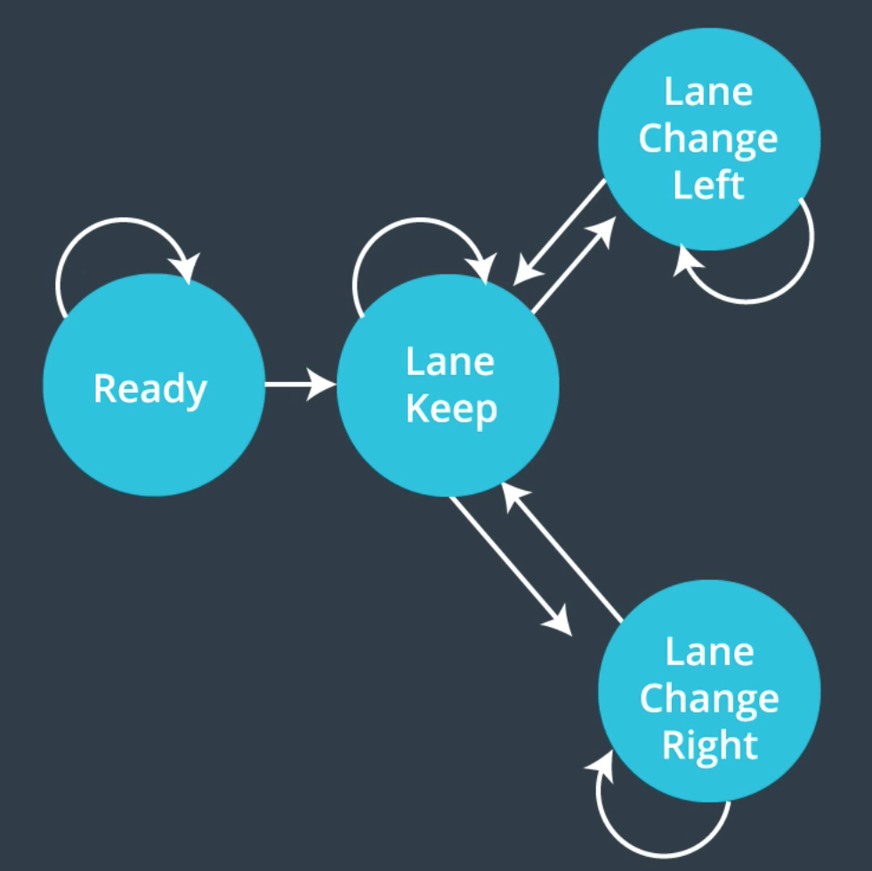
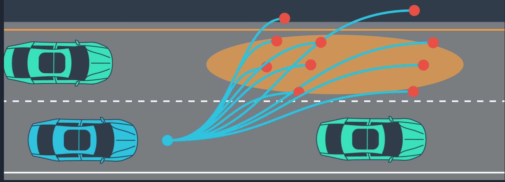

# Korda's Path Planning Project for Udacity Self-Driving Car Nanodegree

[YouTube Video](https://youtu.be/C-2Ck8RVmH8)

[](https://youtu.be/C-2Ck8RVmH8)

<iframe width="560" height="315" src="https://www.youtube.com/embed/C-2Ck8RVmH8" frameborder="0" gesture="media" allowfullscreen></iframe>


### This is my submission for the CarND-Path-Planning-Project described below.

## A quick overview of what a path planner does:
### A path planner acts like your friend who is sitting in the passenger seat navigating for you to help you arrive at your destination. He gives you instructions on when to get in the fast lane or when to prepare to exit the freeway. He gives you the information you need to get where you want to go and then it is your responsibility to maintain control of the vehicle by applying gas, brake, steering, etc., as well as emergency maneuvers for unexpected events. In this project, the Ego car is the car that the path is being planned for.

## Techniques for Path Planning:
### The concepts we learned in this course revolved around a finite state machine (FSM). The FSM is the list of possible states the vehicle can be in and which states are reachable from any current state. The image below best illustrates this concept.





### The planner basically decides which state the car should be in given a certain set of data. This data includes:

* Map data of the road
* Localization data of the Ego vehicle
* Sensor fusion data of other vehicles on the road

### Ideally this data is used to generate a set of noisy possible trajectories for each reachable state.





### These trajectories would then be passed into a set of cost functions which would penalize or reward certain trajectories based on factors including but not limited to:

* Collision avoidance
* Adherance to Laws ( speed limit, road boundaries, etc.)
* Time to destination
* Comfort (minimized Jerk, derivative of acceleration )

### Finally the trajectory with the minimum cost is selected and the state is updated.

## My Implementation
### Now this sounds like a lot to do and it is. So I implemented a much more simplified verision of this architecture given my time constraints (and c++ ability) for this project. My pipeline is outlined below. I found that for this highway simulator if you make decisions based on whether it is safe to change lanes, i.e. there are no cars or they are not approaching too fast, the Ego drives very well. The one thing it is not great at doing is determining which lane change is better if both are available; this is where cost functions could have played a wonderful role. However, the added complexity required for implementing cost functions was not worth the small possible improvement in decision making.

### I built my trajectories using a spline with `20` points spaced every 0.02 seconds. I initially tried `50` points like the instructors did in their project walkthrough, but I found that Ego was too "commited" to its previous trajectory to change its mind if new circumstances arised. That was because `50*0.02 = 1 second` in the future. If anything happend closer than 1 second away from Ego, Ego was blind to it.

### The most time consuming aspect of this project was determining the buffers to avoid collisions during lane changes. I based the buffers on few different factors. The first was related to a vehicle approaching from the rear. I built the buffer based on the `closing_speed` of the vehicle relative to Ego. This allowed Ego to change lanes if a car was just behind Ego in the adjacent lane but traveling at a similar speed. This helped Ego to get out of some cases where it gets boxed in. Another factor was the distance of vehcles in front and in adjacent lanes relative to Ego. If the car in the lane we would like to change into is closer than the car we are following, then why change. Lastly, I added a little logic to decide if both lanes are open, try to get in the lane with the car farther away.

## Areas for Improvement
### I would really like to implement a quintic polynomial for jerk minimizing trajectories. This would allow me to also implement cost fuctions for a more intelligent state machine. I am sure my code could also be optmized for efficiency.

## Reflection
### Usually I am very grateful at the end of a project for how well the lessons were presented and helped me to learn. This time is a littel different. I am still grateful for the work put in by the creators, however, I felt like these lessons left me illprepared for the project implementation. The lessons covered the concepts very well but there was no discussion of implementation techniques and recommended code structure. So once it came time to code I was lost for weeks. I honestly would not have been able to do this project without help from my dear friend @MunirJojoVerge. He helped me to structure and talk through logic. 


## Outline of My Project:
* 1. Ingest and organize the map, sensor fusion (other cars on the road), and Ego car positioning data received from the simulator
* * Road Map waypoints and data:
```
// Road parameters
int num_lanes = 3;
double lane_width = 4; //  meters
double speed_limit = 50; // mph

// Road map of waypoints
RoadMap roadMap{map_waypoints_x, map_waypoints_y, map_waypoints_s,
map_waypoints_dx, map_waypoints_dy, num_lanes, lane_width, speed_limit};
```
* * Sensor Fusion data of other cars on the road:
```
vector<OtherVehicle> vehicles_on_road;
for(int i=0; i<sensor_fusion.size(); i++)
{
  OtherVehicle car;

  car.id = sensor_fusion[i][0];
  car.x = sensor_fusion[i][1];
  car.y = sensor_fusion[i][2];
  car.vx = sensor_fusion[i][3];
  car.vy = sensor_fusion[i][4];
  //car.s = double(sensor_fusion[i][5]);
  car.d = sensor_fusion[i][6];
  car.speed = sqrt(car.vx*car.vx + car.vy*car.vy);
  car.s = double(sensor_fusion[i][5]) + double(prev_size * 0.02 * car.speed); // predicted at end of path
  car.lane = get_lane(car.d, Ego.roadMap.lane_width, Ego.roadMap.num_lanes);

  vehicles_on_road.push_back(car);
}

```
* * Ego vehicle's localization data:
```
double car_x = j[1]["x"];
double car_y = j[1]["y"];
double car_s = j[1]["s"];
double car_d = j[1]["d"];
double car_yaw = j[1]["yaw"];
double car_speed = j[1]["speed"];
// Previous path data given to the Planner
vector<double> previous_path_x = j[1]["previous_path_x"];
vector<double> previous_path_y = j[1]["previous_path_y"];
int prev_size = previous_path_x.size();
// Previous path's end s and d values
double end_path_s = j[1]["end_path_s"];
double end_path_d = j[1]["end_path_d"];

// package car data from sim
vector<double> car_data = {car_x, car_y, car_s, car_d, car_yaw, car_speed,
end_path_s, end_path_d};
```

* 2. Filter the cars on the road to the ones that are most relevant for path planning, e.g. the closest vehicle in the Ego's lane and adjacent lanes.

```
bool only_in_front = true;
// Find the closest vehicle in FRONT and predict its location at Ego's end_path
OtherVehicle Vehicle_Front = find_closest_vehicle(this->lane, vehicles, only_in_front);

// Find the closest vehicle in LEFT and predict its location at Ego's end_path
OtherVehicle Vehicle_Left  = find_closest_vehicle(this->lane-1, vehicles, not only_in_front);

// Find the closest vehicle in RIGHT and predict its location at Ego's end_path
OtherVehicle Vehicle_Right = find_closest_vehicle(this->lane+1, vehicles, not only_in_front);

//Print distance from Ego for closest vehicles in each lane
printf("Distance to closest vechicles (left, front, right): (%g, %g, %g)\n", Vehicle_Left.dist_from_ego,
Vehicle_Front.dist_from_ego, Vehicle_Right.dist_from_ego);

```
* 3. Decision Making Logic Pseudocode:
```
if (no car in Ego lane or car is far enough away):
  Maneuver = Cruise Control
  
else:
  engage Adaptive Cruise Control

  if (both lanes are clear prefer the one with vehicle farther away):
  if (left lane is empty or cars are outside a certain buffer):
    Maneuver = Lane Change Left
    
  else if (right lane is empty or cars are outside a certain buffer):
    Maneuver = Lane Change Right
```
* 4. Execute Maneuver:
```
/**************Switch Case to Execute Maneuver********************/
switch (Maneuver) {

case CC: // Cruise control with no car in front
    printf("MANEUVER EXECUTED CC.........\n\n");
    
    /******************************** Cruise Control***********/
    if(this->vel < this->ref_vel) this->vel += max_accel;
    if(this->vel > this->ref_vel) this->vel -= max_accel;
    /********************************************************/
    
    break;

case LCL:
    printf("MANEUVER EXECUTED LCL.........\n\n");
    this->lane = max(this->lane-1, 0); // subract 1 from lane unless we are already in far left lane
    break;

case LCR:
    printf("MANEUVER EXECUTED LCR.........\n\n");
    this->lane = min(this->lane+1, roadMap.num_lanes-1); // add 1 to lane unless we are already in far right lane
    
    break;

case ACC: //Keep Lane and engage adaptive cruise control
    printf("MANEUVER EXECUTED ACC.........\n\n");
    
    /**************Adaptive Cruise Conntrol********************/
    // uses the proportional gains defined earlier k_decel, k_accel
    if(this->vel > Vehicle_Front.speed) this->vel -= min(k_decel, max_accel);
    else this->vel += min(k_accel, max_accel);
    /***********************************************************/
    
    break;

default:
    break;
}

```
* 5. Generate Planned Trajectory:
```
Pseudocode

pts = evely spaced waypoints 30 meters apart based on desired lane

ref_pos = Ego's furthest position in previous trajectory or current position

spline = spline connecting the points 'pts'
```
* 6. Return the Planned Trajectory to the Simulator:
```
next_x_vals = calculated_trajectory.x_vals;
next_y_vals = calculated_trajectory.y_vals;
```


---
# CarND-Path-Planning-Project
Self-Driving Car Engineer Nanodegree Program
   
### Simulator.
You can download the Term3 Simulator which contains the Path Planning Project from the [releases tab (https://github.com/udacity/self-driving-car-sim/releases).

### Goals
In this project your goal is to safely navigate around a virtual highway with other traffic that is driving +-10 MPH of the 50 MPH speed limit. You will be provided the car's localization and sensor fusion data, there is also a sparse map list of waypoints around the highway. The car should try to go as close as possible to the 50 MPH speed limit, which means passing slower traffic when possible, note that other cars will try to change lanes too. The car should avoid hitting other cars at all cost as well as driving inside of the marked road lanes at all times, unless going from one lane to another. The car should be able to make one complete loop around the 6946m highway. Since the car is trying to go 50 MPH, it should take a little over 5 minutes to complete 1 loop. Also the car should not experience total acceleration over 10 m/s^2 and jerk that is greater than 50 m/s^3.

#### The map of the highway is in data/highway_map.txt
Each waypoint in the list contains  [x,y,s,dx,dy] values. x and y are the waypoint's map coordinate position, the s value is the distance along the road to get to that waypoint in meters, the dx and dy values define the unit normal vector pointing outward of the highway loop.

The highway's waypoints loop around so the frenet s value, distance along the road, goes from 0 to 6945.554.

## Basic Build Instructions

1. Clone this repo.
2. Make a build directory: `mkdir build && cd build`
3. Compile: `cmake .. && make`
4. Run it: `./path_planning`.

Here is the data provided from the Simulator to the C++ Program

#### Main car's localization Data (No Noise)

["x"] The car's x position in map coordinates

["y"] The car's y position in map coordinates

["s"] The car's s position in frenet coordinates

["d"] The car's d position in frenet coordinates

["yaw"] The car's yaw angle in the map

["speed"] The car's speed in MPH

#### Previous path data given to the Planner

//Note: Return the previous list but with processed points removed, can be a nice tool to show how far along
the path has processed since last time. 

["previous_path_x"] The previous list of x points previously given to the simulator

["previous_path_y"] The previous list of y points previously given to the simulator

#### Previous path's end s and d values 

["end_path_s"] The previous list's last point's frenet s value

["end_path_d"] The previous list's last point's frenet d value

#### Sensor Fusion Data, a list of all other car's attributes on the same side of the road. (No Noise)

["sensor_fusion"] A 2d vector of cars and then that car's 

[car's unique ID, 
car's x position in map coordinates, 
car's y position in map coordinates, 
car's vx velocity in m/s, 
car's vy velocity in m/s, 
car's s position in frenet coordinates, 
car's d position in frenet coordinates.] 

## Details

1. The car uses a perfect controller and will visit every (x,y) point it recieves in the list every .02 seconds. The units for the (x,y) points are in meters and the spacing of the points determines the speed of the car. The vector going from a point to the next point in the list dictates the angle of the car. Acceleration both in the tangential and normal directions is measured along with the jerk, the rate of change of total Acceleration. The (x,y) point paths that the planner recieves should not have a total acceleration that goes over 10 m/s^2, also the jerk should not go over 50 m/s^3. (NOTE: As this is BETA, these requirements might change. Also currently jerk is over a .02 second interval, it would probably be better to average total acceleration over 1 second and measure jerk from that.

2. There will be some latency between the simulator running and the path planner returning a path, with optimized code usually its not very long maybe just 1-3 time steps. During this delay the simulator will continue using points that it was last given, because of this its a good idea to store the last points you have used so you can have a smooth transition. previous_path_x, and previous_path_y can be helpful for this transition since they show the last points given to the simulator controller with the processed points already removed. You would either return a path that extends this previous path or make sure to create a new path that has a smooth transition with this last path.

## Tips

A really helpful resource for doing this project and creating smooth trajectories was using http://kluge.in-chemnitz.de/opensource/spline/, the spline function is in a single hearder file is really easy to use.

---

## Dependencies

* cmake >= 3.5
 * All OSes: [click here for installation instructions](https://cmake.org/install/)
* make >= 4.1
  * Linux: make is installed by default on most Linux distros
  * Mac: [install Xcode command line tools to get make](https://developer.apple.com/xcode/features/)
  * Windows: [Click here for installation instructions](http://gnuwin32.sourceforge.net/packages/make.htm)
* gcc/g++ >= 5.4
  * Linux: gcc / g++ is installed by default on most Linux distros
  * Mac: same deal as make - [install Xcode command line tools]((https://developer.apple.com/xcode/features/)
  * Windows: recommend using [MinGW](http://www.mingw.org/)
* [uWebSockets](https://github.com/uWebSockets/uWebSockets)
  * Run either `install-mac.sh` or `install-ubuntu.sh`.
  * If you install from source, checkout to commit `e94b6e1`, i.e.
    ```
    git clone https://github.com/uWebSockets/uWebSockets 
    cd uWebSockets
    git checkout e94b6e1
    ```

## Editor Settings

We've purposefully kept editor configuration files out of this repo in order to
keep it as simple and environment agnostic as possible. However, we recommend
using the following settings:

* indent using spaces
* set tab width to 2 spaces (keeps the matrices in source code aligned)

## Code Style

Please (do your best to) stick to [Google's C++ style guide](https://google.github.io/styleguide/cppguide.html).

## Project Instructions and Rubric

Note: regardless of the changes you make, your project must be buildable using
cmake and make!


## Call for IDE Profiles Pull Requests

Help your fellow students!

We decided to create Makefiles with cmake to keep this project as platform
agnostic as possible. Similarly, we omitted IDE profiles in order to ensure
that students don't feel pressured to use one IDE or another.

However! I'd love to help people get up and running with their IDEs of choice.
If you've created a profile for an IDE that you think other students would
appreciate, we'd love to have you add the requisite profile files and
instructions to ide_profiles/. For example if you wanted to add a VS Code
profile, you'd add:

* /ide_profiles/vscode/.vscode
* /ide_profiles/vscode/README.md

The README should explain what the profile does, how to take advantage of it,
and how to install it.

Frankly, I've never been involved in a project with multiple IDE profiles
before. I believe the best way to handle this would be to keep them out of the
repo root to avoid clutter. My expectation is that most profiles will include
instructions to copy files to a new location to get picked up by the IDE, but
that's just a guess.

One last note here: regardless of the IDE used, every submitted project must
still be compilable with cmake and make./

## How to write a README
A well written README file can enhance your project and portfolio.  Develop your abilities to create professional README files by completing [this free course](https://www.udacity.com/course/writing-readmes--ud777).


